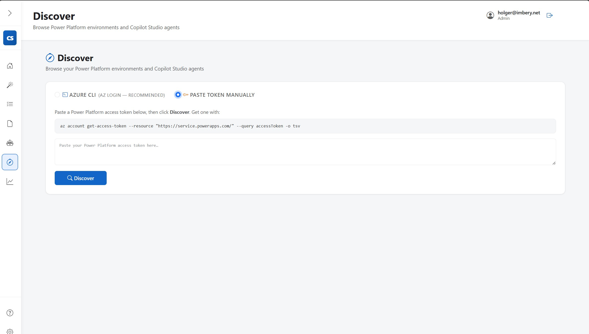
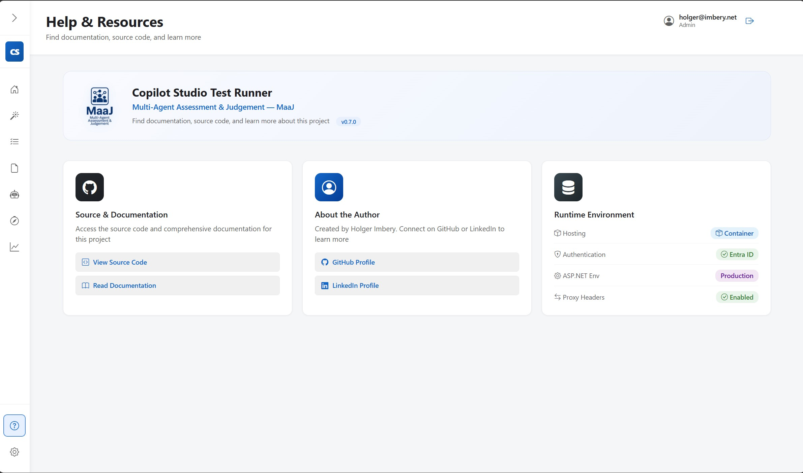
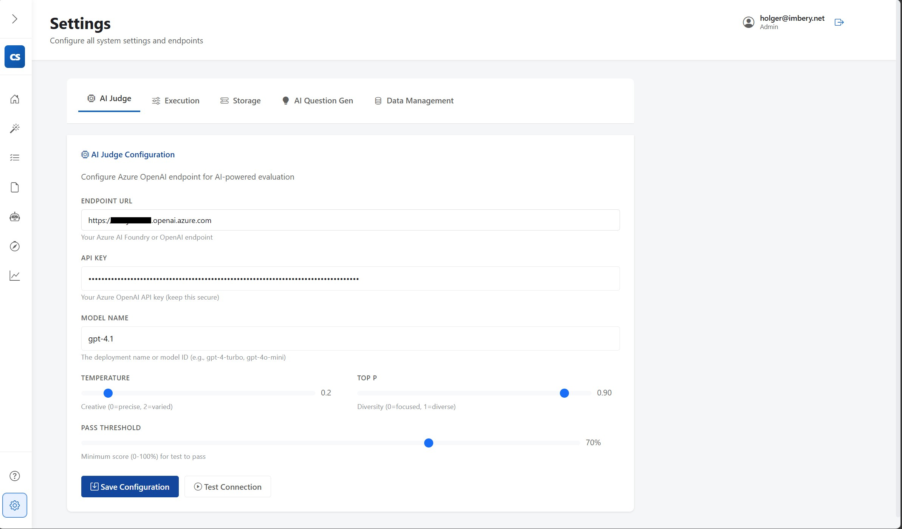

<p align="center">
  
</p>


# Copilot Studio Test Runner - Multi‑Agent Assessment & Judgement

An enterprise-grade, **multi-agent aware** .NET 9 application for automated testing of Microsoft Copilot Studio agents.
Test multiple agents simultaneously across environments, evaluate responses with Azure AI Foundry models, generate test cases from documents, and gain comprehensive quality metrics

> **Full documentation is available in the [Wiki](https://github.com/holgerimbery/MaaJforMCS/wiki).**

---
> MaaJ is **not** intended to replace the Microsoft Copilot Studio Kit or Copilot Studio Evaluation. Instead, it serves as a **flexible, open starting point** for automated, enterprise‑grade verification and validation of Copilot Studio agents. Its purpose is to give users **full control over every aspect of the testing process** — both through a transparent GUI and through fully accessible source code—so they can adapt, extend, and integrate the testing workflow to meet their specific architectural, compliance, and automation requirements

---

## Key Features

- **Multi-Agent Testing** — run the same test suite against dev, staging, and production agents in parallel
- **Environment & Agent Discovery** — browse all Power Platform environments and import Copilot Studio agents automatically via Azure CLI or service principal
- **Direct Line Integration** — WebSocket or polling transport with full conversation lifecycle management
- **Model-as-a-Judge Evaluation** — Azure AI Foundry LLM scores responses on 5 dimensions (task success, intent match, factuality, helpfulness, safety)
- **Document-Driven Test Generation** — upload PDFs or text files and let AI generate test cases automatically
- **Setup Wizard** — guided first-run agent and test suite creation
- **CLI for CI/CD** — exit codes, JSON output, dry-run support
- **Microsoft Entra ID Authentication** — optional enterprise SSO with Admin / Tester / Viewer RBAC roles
- **Backup & Restore** — download a full database snapshot and restore from the Settings page (Admin only)
- **Local-First & Container-Ready** — runs entirely on-premise or in a container via Docker Compose; only calls Direct Line and an AI Foundry endpoint

---

## Screenshots








---

## Quick Start (no build required)

The fastest way to get running is to download the **quickstart package** from the latest GitHub Release — no .NET SDK or source code needed, just Docker.
The container image is pulled automatically from Docker Hub ([holgerimbery/maaj](https://hub.docker.com/r/holgerimbery/maaj)).

1. **Download** `maaj-quickstart-{version}.zip` from the [latest release](https://github.com/holgerimbery/MaaJforMCS/releases/latest) and unzip it
2. **Copy** the env template:
   ```
   # Windows
   copy .env.template .env
   # Mac / Linux
   cp .env.template .env
   ```
3. **Edit `.env`** — fill in your Azure OpenAI endpoint, API key, and model name
4. **Start**:
   ```bash
   docker compose up -d
   ```
5. **Open** `http://localhost:5062` — the Setup Wizard guides you through the rest

Data is stored in a named Docker volume (`maaj-data`) and persists across restarts.
Use **Settings → Data Management** to download a backup at any time.

> Authentication is **disabled by default** in the quickstart package — all users get Admin access.
> Set `AUTHENTICATION_ENABLED=true` and fill in the `AZURE_*` values if the app will be internet-accessible.
> See [Entra ID Setup](https://github.com/holgerimbery/MaaJforMCS/wiki/Entra-ID-Setup).

---

## Quick Start (from source)

```bash
# Clone and build
git clone <repository-url>
cd MaaJforMCS
dotnet build

# Start the Web UI
cd CopilotStudioTestRunner.WebUI
dotnet run
# Open http://localhost:5062 — the Setup Wizard launches automatically
```

The wizard guides you through creating your first agent, uploading documents, generating test cases, and running your first suite.

For a step-by-step walkthrough see [Quick Start](https://github.com/holgerimbery/MaaJforMCS/wiki/Quick-Start).

---

## Docker Deployment

Docker support is fully implemented. :white_check_mark:

```bash
# Build and start (all configuration via .env)
docker compose up -d
```

Create a `.env` file from the template below — authentication is controlled by a single flag, no override file required:

```dotenv
JUDGE_ENDPOINT=https://your-resource.openai.azure.com/
JUDGE_API_KEY=your-api-key-here
JUDGE_MODEL=gpt-4o

# Set to true and fill in the Azure AD values to enable Entra ID authentication
AUTHENTICATION_ENABLED=false
AZURE_TENANT_ID=
AZURE_CLIENT_ID=
AZURE_CLIENT_SECRET=
```

Full details including Kubernetes deployment in [Docker Deployment](https://github.com/holgerimbery/MaaJforMCS/wiki/Docker-Deployment).

---

## Documentation

| Topic | Link |
|-------|------|
| Getting Started | [Getting-Started](https://github.com/holgerimbery/MaaJforMCS/wiki/Getting-Started) |
| Quick Start (5 min) | [Quick-Start](https://github.com/holgerimbery/MaaJforMCS/wiki/Quick-Start) |
| Setup Wizard | [Setup-Wizard](https://github.com/holgerimbery/MaaJforMCS/wiki/Setup-Wizard) |
| Environment & Agent Discovery | [Environment-Discovery](https://github.com/holgerimbery/MaaJforMCS/wiki/Environment-Discovery) |
| Multi-Agent Testing | [Multi-Agent-Testing](https://github.com/holgerimbery/MaaJforMCS/wiki/Multi-Agent-Testing) |
| Architecture | [Architecture](https://github.com/holgerimbery/MaaJforMCS/wiki/Architecture) |
| Configuration Reference | [Configuration-Reference](https://github.com/holgerimbery/MaaJforMCS/wiki/Configuration-Reference) |
| Authentication & RBAC | [Authentication](https://github.com/holgerimbery/MaaJforMCS/wiki/Authentication) · [Entra ID Setup](https://github.com/holgerimbery/MaaJforMCS/wiki/Entra-ID-Setup) · [RBAC and Roles](https://github.com/holgerimbery/MaaJforMCS/wiki/RBAC-and-Roles) |
| Judge Evaluation | [Judge-Evaluation](https://github.com/holgerimbery/MaaJforMCS/wiki/Judge-Evaluation) |
| Document Processing | [Document-Processing](https://github.com/holgerimbery/MaaJforMCS/wiki/Document-Processing) |
| Test Suites & Cases | [Test-Suites-and-Cases](https://github.com/holgerimbery/MaaJforMCS/wiki/Test-Suites-and-Cases) |
| CLI Reference | [CLI-Reference](https://github.com/holgerimbery/MaaJforMCS/wiki/CLI-Reference) |
| API Reference | [API-Reference](https://github.com/holgerimbery/MaaJforMCS/wiki/API-Reference) |
| Docker Deployment | [Docker-Deployment](https://github.com/holgerimbery/MaaJforMCS/wiki/Docker-Deployment) |
| Backup & Restore | [Backup-Restore](https://github.com/holgerimbery/MaaJforMCS/wiki/Backup-Restore) |
| Troubleshooting | [Troubleshooting](https://github.com/holgerimbery/MaaJforMCS/wiki/Troubleshooting) |

---

## Contributing

1. Fork the repository
2. Create a feature branch
3. Submit a pull request

---

## License

MIT 2026 Holger Imbery

